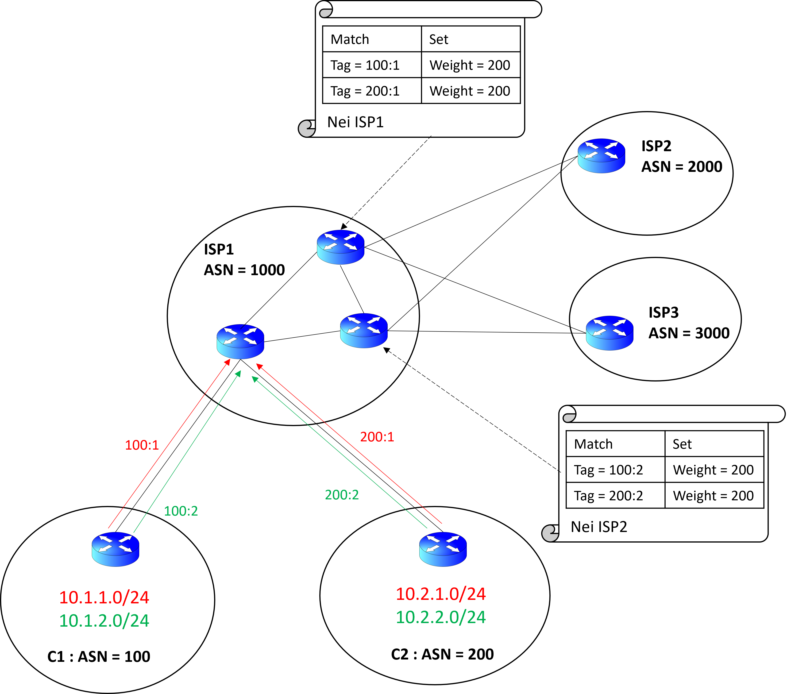
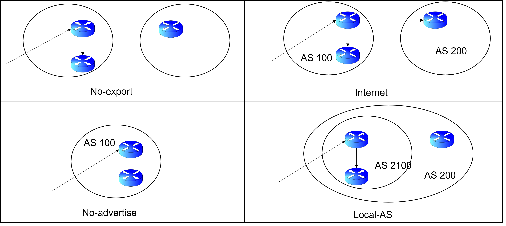
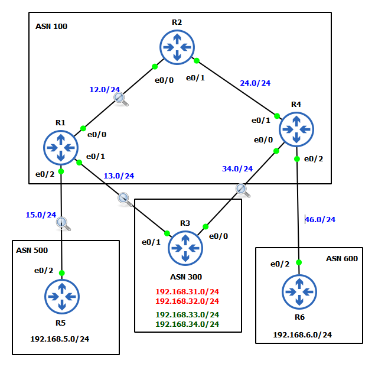
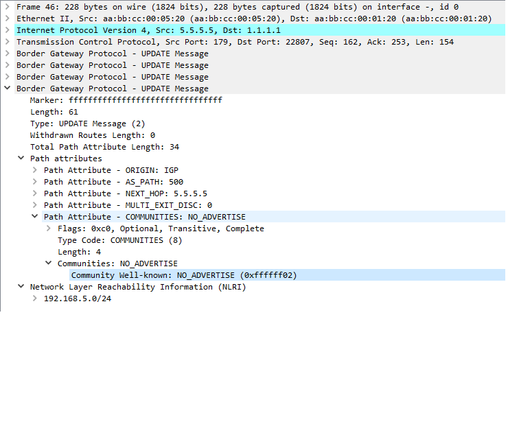
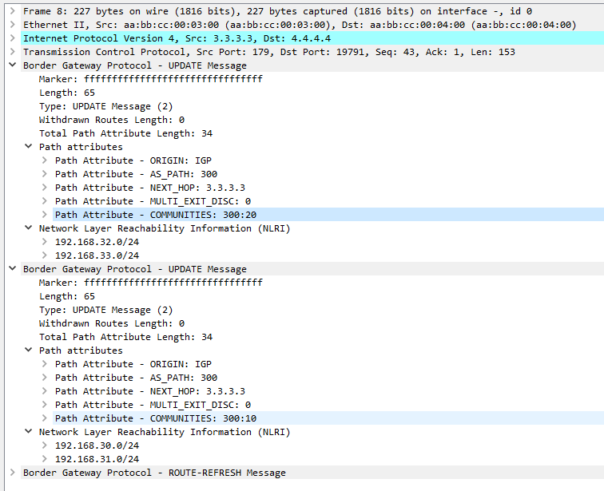

# Commmunities


## Basics

* Jt is a method of tagging a set of prefixes that share a common properties. 
* Community is an optional trasitive attribute 
* It is used for tagging a route. When a BGP update carries an NLRI it also tags it with a community value, which the BGP routers along the paths uses to decide policies associated with the tag.
    * Path-manipualtion (Determining exit paths).
    * Route-filtering etc. 
* Any BGP router can tag a route at the time of receiving, sending or redistributing a route.
    * Path Manipilation is done by the updtream rouoter and the downstream router will tag the advertisements. 
* By default, communities are stripped in outgoing BGP updates. use __`send-community`__ to tell the IOS to keep the communities info. 


Assume the following situation, Customer 1 and 2 are connnected with ISP1 which as two neighbours ISP 2 and 3. Now, ISP1 wants to steer all trafffic of `10.1.1.0/24` and `10.2.1.0/24` routes from cust 1 and cust 2 respectively to ISP2 and `10.1.2.0/24` and `10.2.2.0/24` routes to ISP3. then the following will happen.
1. ISP will tell customer 1 and 2 to tag their respective route using BGP communities values. 
2. The tags are transitive, thus they will rach the end points of ISP1
3. The end router will implement a community list to match community tags to choose the appropreate exit route using the weight attribute. 
   
   


## Types of Communities 


* __Well Known__ : Pre-defined in the BGP
    * __`no-export`__ : Does not get advertised to eBGP peers, kept in the local AS only. e.g. Routes from a customer is not advertised to another customer. 
    * __`no-advertise`__: Does not get advertised to any peers. e.g. When a customer sends routes the PE only. 
    * __`internet`__: Default tag value, routes are advertised to all neigbours. 
    * __`local-as`__: Does not get advertised outside Local-AS (Confideration)
* __Custom__ : Defined by the user 
    * 32 bits number. Old way (0-4B), new way (__ASN:nn__) 16+16 format.
    * By deafult the IOS internally stores the community values as the old format only. However to use the new format use the command __`ip bgp community new-format`__.
    

 ## Base Topology Setup
 
 

__r1__

```
conf t
	int e0/0
		ip add	192.168.12.1 255.255.255.0
		no sh 
	int e0/1
		ip add 192.168.13.1 255.255.255.0
		no sh
	int e0/2
		ip add 192.168.15.1 255.255.255.0
		no sh
	int l0
		ip add 1.1.1.1 255.255.255.0

	ip route 2.2.2.0 255.255.255.0 e0/0
	ip route 3.3.3.0 255.255.255.0 e0/1
	ip route 4.4.4.0 255.255.255.0 e0/0
	ip route 5.5.5.0 255.255.255.0 e0/2
	
	router bgp 100
		bgp router-id 1.1.1.1	
			
		nei LOCAL peer-group
		nei LOCAL remote-as 100
		nei LOCAL update-source l0
		nei LOCAL next-hop-self
		nei LOCAL password Cisco123

		nei REMOTE peer-group
		nei REMOTE update-source l0
		nei REMOTE ebgp-multi 2
		nei REMOTE password Cisco123

		nei 2.2.2.2 peer-group LOCAL
		nei 4.4.4.4 peer-group LOCAL
		
		nei 3.3.3.3 remote-as 300
		nei 3.3.3.3 peer-group REMOTE

		nei 5.5.5.5 remote-as 500
		nei 5.5.5.5 peer-group REMOTE
        
        net 192.168.12.0 
		net 192.168.13.0
		net 192.168.15.0
	exit
end 
```
__r2__

```
conf t
	int e0/0
		ip add	192.168.12.2 255.255.255.0
		no sh 
	int e0/1
		ip add 192.168.24.2 255.255.255.0
		no sh
	int l0
		ip add 2.2.2.2 255.255.255.0

	ip route 1.1.1.0 255.255.255.0 e0/0
	ip route 4.4.4.0 255.255.255.0 e0/1

	router bgp 100
		bgp router-id 2.2.2.2
		
		nei LOCAL peer-group
		nei LOCAL remote-as 100
		nei LOCAL update-source l0
		nei LOCAL next-hop-self
		nei LOCAL password Cisco123
			
		nei 1.1.1.1 peer-group LOCAL
		nei 4.4.4.4 peer-group LOCAL
        
        net 192.168.12.0 
		net 192.168.24.0
	exit

end 
```

__r3__

```
conf t
	int e0/0
		ip add	192.168.34.3 255.255.255.0
		no sh 
	int e0/1
		ip add 192.168.13.3 255.255.255.0
		no sh
	int l0
		ip add 3.3.3.3 255.255.255.0

	ip route 1.1.1.0 255.255.255.0 e0/1
	ip route 4.4.4.0 255.255.255.0 e0/0

	router bgp 300
		bgp router-id 3.3.3.3
			
		nei REMOTE peer-group
		nei REMOTE update-source l0
		nei REMOTE ebgp-multi 2
		nei REMOTE password Cisco123

		nei 1.1.1.1 remote-as 100
		nei 1.1.1.1 peer-group REMOTE

		nei 4.4.4.4 remote-as 100
		nei 4.4.4.4 peer-group REMOTE
        
        net 192.168.13.0
		net 192.168.34.0
	exit

end 
```

__r4__

```
conf t
	int e0/0
		ip add	192.168.34.4 255.255.255.0
		no sh 
	int e0/1
		ip add 192.168.24.4 255.255.255.0
		no sh
	int e0/2
		ip add 192.168.46.4 255.255.255.0
		no sh
	int l0
		ip add 4.4.4.4 255.255.255.0

	ip route 2.2.2.0 255.255.255.0 e0/1
	ip route 3.3.3.0 255.255.255.0 e0/0
	ip route 1.1.1.0 255.255.255.0 e0/1
	ip route 6.6.6.0 255.255.255.0 e0/2	

	router bgp 100
		bgp router-id 4.4.4.4

		nei LOCAL peer-group
		nei LOCAL remote-as 100
		nei LOCAL update-source l0
		nei LOCAL next-hop-self
		nei LOCAL password Cisco123

		nei REMOTE peer-group
		nei REMOTE update-source l0
		nei REMOTE ebgp-multi 2
		nei REMOTE password Cisco123
			
		nei 1.1.1.1 peer-group LOCAL
		nei 2.2.2.2 peer-group LOCAL
			
		nei 3.3.3.3 remote-as 300
		nei 3.3.3.3 peer-group REMOTE
		
		nei 6.6.6.6 remote-as 600
		nei 6.6.6.6 peer-group REMOTE
        
        net 192.168.24.0 
		net 192.168.34.0
		net 192.168.46.0
	exit

end 
```
	
__r5__

```
conf t
	int e0/2
		ip add 192.168.15.5 255.255.255.0
		no sh
	int l0
		ip add 5.5.5.5 255.255.255.0

	ip route 1.1.1.0 255.255.255.0 e0/2

	router bgp 500
		bgp router-id 5.5.5.5
			
		nei 1.1.1.1 remote-as 100
		nei 1.1.1.1 update-source l0
		nei 1.1.1.1 ebgp-multihop 2
		nei 1.1.1.1 password Cisco123
        
        net 192.168.15.0
	exit

end 
```
__r6__

```
conf t
	int e0/2
		ip add 192.168.46.6 255.255.255.0
		no sh
	int l0
		ip add 6.6.6.6 255.255.255.0
	
	ip route 4.4.4.0 255.255.255.0 e0/2
	
	router bgp 600
		bgp router-id 6.6.6.6
			
		nei 4.4.4.4 remote-as 100
		nei 4.4.4.4 update-source l0
		nei 4.4.4.4 ebgp-multihop 2
		nei 4.4.4.4 password Cisco123
        
        net 192.168.46.0
	exit

end 
```

## Task 1 : `no-advertise ` community 

1. Add an interface Loopback-1 with `192.168.5.0/24` at R5.
2. Advertise the network to its BGP neigbour only. 

### Solution 
* the advertisement must not be advertise to R1 onluy, not to any of its neighbous, i.e. the community type is `no_advertise`
* the configuration can be done using either of two ways
    * R5 as outbound (preffered) or
    * R1 as inbound 


__R5__
```
conf t
    ip access stand ACL_COMM
        permit 192.168.5.0 0.0.0.255 !match the route
    exit
    
    route-map RM_COMM permit 10
        match ip address ACL_COMM
        set community no-advertise   !set the community value
    exit
    
    router bgp 
        net 1.1.1.1 send-community   !activaye community 
        nei 1.1.1.1 route-map RM_COMM out !apply outbound community tagging  
    exit
end

clear ip bgp * soft
```

### Verification

1. Packet capture 


2. From R1 `sh ip bgp 192.168.5.0`

```
BGP routing table entry for 192.168.5.0/24, version 10
Paths: (1 available, best #1, table default, not advertised to any peer)
  Not advertised to any peer
  Refresh Epoch 2
  500
    5.5.5.5 from 5.5.5.5 (5.5.5.5)
      Origin IGP, metric 0, localpref 100, valid, external, best
      Community: no-advertise
      rx pathid: 0, tx pathid: 0x0
```

3. From R2 `sh ip route bgp`

```
B     192.168.13.0/24 [200/0] via 1.1.1.1, 00:25:34
B     192.168.15.0/24 [200/0] via 1.1.1.1, 00:25:30
B     192.168.34.0/24 [200/0] via 4.4.4.4, 00:24:30
B     192.168.46.0/24 [200/0] via 4.4.4.4, 00:24:29
```

## Task 2: `no-export` community

1. Add an inttface Loopback-1 with `192.168.6.1/24` at R6.
2. Advertise the route to the local next AS (AS100) only

### Solutuion
* Advertisement propagation is limited to ASN100 
* R4 will advertise the routes to its iBGP peer but no ebgp peer. 
* Community type = `no-export`

```
conf t
    access-list 5 permit 192.168.6.0 0.0.0.255
    route-map Rm_COMM permit 10
        match ip add 5
        set community no-export 
    exit
    
    router bgp
        net 192.168.6.0
        nei 4.4.4.4 send-community 
        net 4.4.4.4 route-map RM_COMM out 
    exit
end
clear ip bgp * soft
```

### Verification

1. BGP table entry from R4, `sh ip bgp 192.168.6.0`

```
BGP routing table entry for 192.168.6.0/24, version 14
Paths: (1 available, best #1, table default, not advertised to EBGP peer)
  Advertised to update-groups:
     1
  Refresh Epoch 1
  600
    6.6.6.6 from 6.6.6.6 (6.6.6.6)
      Origin IGP, metric 0, localpref 100, valid, external, best
      Community: no-export
      rx pathid: 0, tx pathid: 0x0
```

2. Routing table at R1, `sh ip route bgp`

```
B     192.168.5.0/24 [20/0] via 5.5.5.5, 00:26:24
B     192.168.6.0/24 [200/0] via 4.4.4.4, 00:00:21
B     192.168.24.0/24 [200/0] via 2.2.2.2, 00:38:20
B     192.168.34.0/24 [200/0] via 4.4.4.4, 00:37:46
B     192.168.46.0/24 [200/0] via 4.4.4.4, 00:37:45
```

3. BGP table at R3, the network `192.168.6.0` is adverised by R1 only, R4 is not advertising. 

```
     Network          Next Hop            Metric LocPrf Weight Path
 *>  192.168.6.0      1.1.1.1                                0 100 600 i
```

To solve the issue that R3 still gets the `192.168.6.0/24` routes, R4 can pass-on the community information to R1 that it receives from R6. You might need to the LOCAL peer group with `net LOCAL send-community` command. otherwise,

```
!r4
conf t
    router bgp 100
        nei 1.1.1.1 send-community
end
clear ip bgp * soft
```


## Task 3: Custom commuity tagging 

1. Add 4 new interfaces to R3 `192.168.[30-33].0/24`.
2. R3 is multi-hommed with ASN100 by R1 and R4. Configure R3 in a way, such that, `192.168.[30,31].0/24` are reachable from ISP-100 via R1 and `192.168.[32,33].0/24` are via R4. 

### solution 
* Match network id, tag with community-id and Advertise communities to the eBGP peers.
| network id | community-tag |
|--|--|
| 192.168.30.0 | 300:10|
| 192.168.31.0 ||
| 192.168.32.0 | 300:20 |
| 192.168.33.0 ||
* ISP routers will match the communites using community list
* Match the community list and 
| Community list | matches | 
|--|--|
|10 | permit 300:10 |
|20| permit 300:20 |
*  loca-pref above default(100) for appropreate community list at the corresponding routers
| router | matching comm_list | set local pref | 
|--|--|--|
| R1 | 10 | 200 |
|| default | 100 |
|R2 | 20 | 200 |
||default | 100| 
* Apply route map to nei R3

__R3__

```
conf t
    ip access-list stand ACL_10 
        permit 192.168.30.0 0.0.0.255
        permit 192.168.31.0 0.0.0.255
    exit
    
    ip access-list stand ACL_20 
        permit 192.168.32.0 0.0.0.255
        permit 192.168.33.0 0.0.0.255
    exit
    
    route-map RM_COMM permit 10
        match ip address ACL_10
        set community 300:10
    exit
    route-map RM_COMM permit 20
        match ip address ACL_20
        set community 300:20
    exit
    
    ip bgp-community new-format !activate aa:nn format at IOS
    
    router bgp 300
        ! apply policy to the REMOTE community
        nei REMOTE send-community
        net REMOTE route-map RM_COMM out 
    exit
end
clear ip bgp* soft
```

__R1__

```
conf t
    ip bgp-community new-format
    
    !create a Community-list to mactch tags
    ip community-list 10 permit 300:10
    ip community list 20 permit 300:20
    
    !Set local_pref based on community list 
    route-map RM_LOCP permit 10
        match community 10   ! for 300:10
        set local-pref 200   ! set LP=200
    exit
    route-map RM_LOCP permit 20 
    exit                     ! for rest use default (100)
    
    router bgp 100
        nei 3.3.3.3 route-map RM_LOCP in ! apply RM locally
    exit
end
clear ip bgp * soft
```

__R4__

```
conf t
    ip bgp-community new-format
    
    !create a Community-list to mactch tags
    ip community-list 10 permit 300:10
    ip community list 20 permit 300:20
    
    !Set local_pref based on community list 
    route-map RM_LOCP permit 10
        match community 20   ! for 300:20
        set local-pref 200   ! set LP=200
    exit
    route-map RM_LOCP permit 20 
    exit                     ! for rest use default (100)
    
    router bgp 100
        nei 3.3.3.3 route-map RM_LOCP in ! apply RM locally
    exit
end
clear ip bgp * soft
```

### Verification
1. Packet capture 


1. BGP table from R1, `sh ip bgp`

```
     Network          Next Hop            Metric LocPrf Weight Path
 *>  192.168.5.0      5.5.5.5                  0             0 500 i
 *>i 192.168.6.0      4.4.4.4                  0    100      0 600 i
 * i 192.168.12.0     2.2.2.2                  0    100      0 i
 *>                   0.0.0.0                  0         32768 i
 *>  192.168.13.0     0.0.0.0                  0         32768 i
 *>  192.168.15.0     0.0.0.0                  0         32768 i
 * i 192.168.24.0     4.4.4.4                  0    100      0 i
 *>i                  2.2.2.2                  0    100      0 i
 *>  192.168.30.0     3.3.3.3                  0    200      0 300 i
 *>  192.168.31.0     3.3.3.3                  0    200      0 300 i
 *>  192.168.32.0     3.3.3.3                  0             0 300 i
 *>  192.168.33.0     3.3.3.3                  0             0 300 i
 *>i 192.168.34.0     4.4.4.4                  0    100      0 i
 *>i 192.168.46.0     4.4.4.4                  0    100      0 i

```

2. BGP table from R3, `sh ip bgp`

```
 *>  192.168.6.0      6.6.6.6                  0             0 600 i
 * i 192.168.12.0     2.2.2.2                  0    100      0 i
 *>i                  1.1.1.1                  0    100      0 i
 *>i 192.168.13.0     1.1.1.1                  0    100      0 i
 *>i 192.168.15.0     1.1.1.1                  0    100      0 i
 *>  192.168.24.0     0.0.0.0                  0         32768 i
 * i                  2.2.2.2                  0    100      0 i
 *   192.168.30.0     3.3.3.3                  0             0 300 i
 *>i                  1.1.1.1                  0    200      0 300 i
 *   192.168.31.0     3.3.3.3                  0             0 300 i
 *>i                  1.1.1.1                  0    200      0 300 i
 *>  192.168.32.0     3.3.3.3                  0    200      0 300 i
 *>  192.168.33.0     3.3.3.3                  0    200      0 300 i
 *>  192.168.34.0     0.0.0.0                  0         32768 i
 *>  192.168.46.0     0.0.0.0                  0         32768 i
```

3. Verigy community tags from R1/R4 `sh ip bgp {NET} | in Community`

```
R4#sh ip bgp 192.168.30.0 | in Community
      Community: 300:10
R4#sh ip bgp 192.168.31.0 | in Community
      Community: 300:10
R4#sh ip bgp 192.168.32.0 | in Community
      Community: 300:20
R4#sh ip bgp 192.168.33.0 | in Community
      Community: 300:20
```

4. Verify path when pinging `192.168.[30-33].0/24` from R6

```
R6#trace 192.168.30.1
Type escape sequence to abort.
Tracing the route to 192.168.30.1
VRF info: (vrf in name/id, vrf out name/id)
  1 192.168.46.4 0 msec 0 msec 0 msec
  2 192.168.24.2 [AS 100] 1 msec 1 msec 1 msec
  3 192.168.12.1 [AS 100] 1 msec 0 msec 1 msec
  4 192.168.13.3 [AS 100] 2 msec 1 msec 1 msec
  
R6#trace 192.168.31.1
Type escape sequence to abort.
Tracing the route to 192.168.31.1
VRF info: (vrf in name/id, vrf out name/id)
  1 192.168.46.4 1 msec 1 msec 0 msec
  2 192.168.24.2 [AS 100] 1 msec 1 msec 1 msec
  3 192.168.12.1 [AS 100] 1 msec 1 msec 1 msec
  4 192.168.13.3 [AS 100] 1 msec 1 msec 1 msec
  
R6#trace 192.168.32.1
Type escape sequence to abort.
Tracing the route to 192.168.32.1
VRF info: (vrf in name/id, vrf out name/id)
  1 192.168.46.4 0 msec 0 msec 0 msec
  2 192.168.34.3 [AS 100] 1 msec 1 msec 1 msec
  
R6#trace 192.168.33.1
Type escape sequence to abort.
Tracing the route to 192.168.33.1
VRF info: (vrf in name/id, vrf out name/id)
  1 192.168.46.4 0 msec 1 msec 0 msec
  2 192.168.34.3 [AS 100] 2 msec 1 msec 1 msec

```
